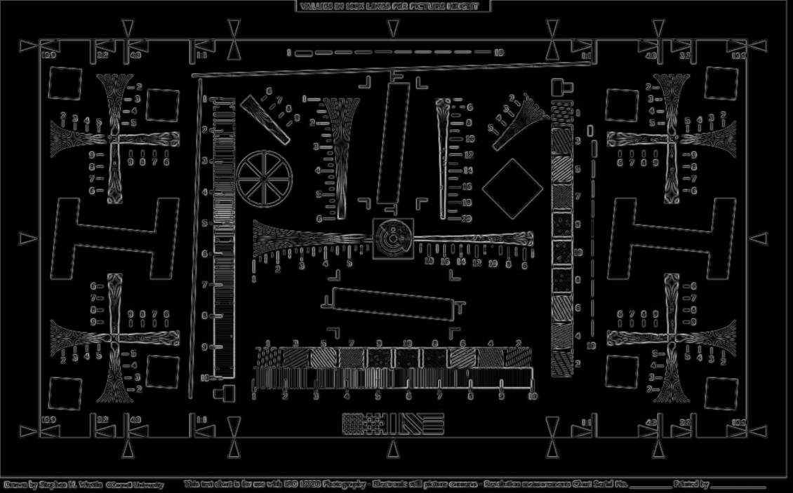

# Processing
> Processing is an edge detection tool part of a Rembrandt-style robotic arm solution developed by Mojo Robos

### Installing
  - `cd /path/to/image_processing/`
  - `make`

### Usage
  - `./processing "path/to/imageIn.jpg" "path/to/imageOut.jpg"`

### Args specs
  - `ImageIn`: Image input

	

  - `ImageOut`: Image output

	

# LICENSE
This project extends GNU GPL v. 3, so be aware of that, regarding copying, modifying and (re)destributing the application.

